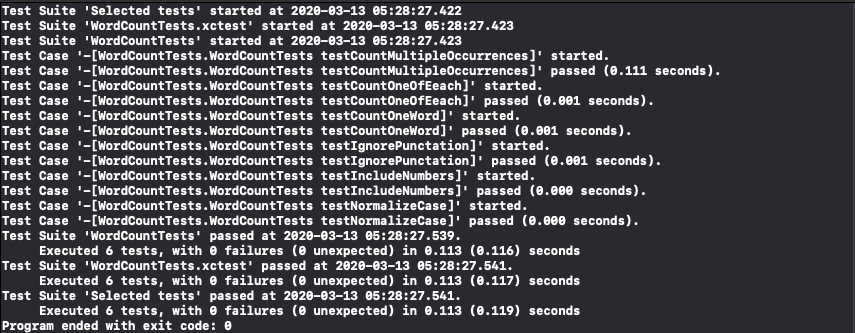

# <center>IOS Swift Exercise</center>

<div align=center> 
    Name: 陈锰 <br/>
    ID: 3170105197 <br/> 
    Major: Software Engineering
</div>

## Requirement

- 截止日期: 03-25-2020

- 在[exercism](https://exercism.io/my/tracks/swift)中选取并完成10道难度**MEDIUM**及以上的题目，实验可在本地完成，通过题目对应的tests，并提交PDF版本实验报告，包含题目，简单思路和源代码

## Exercise

#### P1: Wordy ==Level:Medium==

> Parse and evaluate simple math word problems returning the answer as an integer.
>
> ###### Iteration 1 — Addition
>
> Add two numbers together.
>
> What is 5 plus 13?
>
> Evaluates to 18.
>
> Handle large numbers and negative numbers.
>
> ###### Iteration 2 — Subtraction, Multiplication and Division
>
> Now, perform the other three operations.
>
> What is 7 minus 5?
>
> 2
>
> What is 6 multiplied by 4?
>
> 24
>
> What is 25 divided by 5?
>
> 5
>
> ###### Iteration 3 — Multiple Operations
>
> Handle a set of operations, in sequence.
>
> Since these are verbal word problems, evaluate the expression from left-to-right, ignoring the typical order of operations.
>
> What is 5 plus 13 plus 6?
>
> 24
>
> What is 3 plus 2 multiplied by 3?
>
> 15 (i.e. not 9)
>
> ###### Bonus — Exponentials
>
> If you'd like, handle exponentials.
>
> What is 2 raised to the 5th power?
>
> 32

##### Solution

- 解析字符串：将字符串中的`plus,minus,multipied,divided`分别替换为`+-*/`，再过滤掉无关字符
- 切片字符串：以空格为分隔符，将解析的字符串分解成操作数和操作符的数组
- 计算结果：遍历操作数组，若为操作符则给`op`赋相应的闭包。若为操作数则调用`op`闭包计算结果
- 抛出异常：自定义`WordyError`，遇到非法格式抛出异常

##### Source Code

```swift
//Solution goes in Sources
import Foundation
//Self-defined Wordy Exception
enum WordyError: Error
{
    case InvalidFormat
}

class WordProblem
{
    let question: String
    //Initialize object and parse question string
    init(_ question: String)
    {
        self.question = question
            .replacingOccurrences(of: "plus", with: "+")
            .replacingOccurrences(of: "minus", with: "-")
            .replacingOccurrences(of: "multiplied", with: "*")
            .replacingOccurrences(of: "divided", with: "/")
            .filter{"+-*/ 0123456789".contains($0)}
            .trimmingCharacters(in: .whitespaces)
    }
    //Answer function
    func answer() throws -> Int
    {
        if question.filter({"+-*/".contains($0)}).count <= 0
        {
            throw WordyError.InvalidFormat
        }
        let items = question.split(separator: " ")
        var res = 0
        if let num0 = Int(items[0])
        {
            res = num0
            var op: ((Int, Int) -> Int)?
            for i in 1..<items.count
            {
                switch items[i]
                {
                case "+": op = {$0 + $1}
                case "-": op = {$0 - $1}
                case "*": op = {$0 * $1}
                case "/": op = {$0 / $1}
                default:
                    if let num = Int(items[i])
                    {
                        if op != nil {res = op!(res, num)}
                        else {throw WordyError.InvalidFormat}
                    }
                    else
                    {
                        throw WordyError.InvalidFormat
                    }
                }
            }
        }
        else
        {
            throw WordyError.InvalidFormat
        }
        return res
    }
}
```

##### Screenshot


---

#### P2: Minesweeper ==Level:Medium==

> Add the numbers to a minesweeper board.
>
> Minesweeper is a popular game where the user has to find the mines using numeric hints that indicate how many mines are directly adjacent (horizontally, vertically, diagonally) to a square.
>
> In this exercise you have to create some code that counts the number of mines adjacent to a square and transforms boards like this (where * indicates a mine):
>
> > +-----+
> > | * * |
> > |  *  |
> > |  *  |
> > |     |
> > +-----+
>
> into this:
>
> > +-----+
> > |1*3*1|
> > |13*31|
> > | 2*2 |
> > | 111 |
> > +-----+

##### Solution

- 字符矩阵：讲输入的字符串数组变换成字符矩阵
- 正则检查：定义头尾和中间字符串的正则表达式进行检查
- 抛出异常：自定义三种错误类型，在正则检查时抛出相应的错误
- 变换矩阵：遍历二维字符矩阵，并根据预先定义的`offset`去遍历周围八个字符，累计`*`个数并变换字符
- 返回结果：将二维字符矩阵每行连接成串返回

##### Source Code

```swift
//Solution goes in Sources
import Foundation

class Board
{
    //Self-defined BoarderError
    enum BoardError: Error
    {
        case differentLength
        case faultyBorder
        case invalidCharacter
    }
    //Offset x-y
    let offset: [(Int, Int)] = [(-1, -1), (-1, 0), (-1, 1), (0, -1), (0, 1), (1, -1), (1, 0), (1, 1)]
    
    var matrix: [[String]]
    let width, height: Int
    init(_ board: [String]) throws
    {
        matrix = board.reduce(into: [[]]) { result, item in
            result.append(item.map{String($0)})
        }
        matrix.removeAll(where: {$0.isEmpty})
        width = board[0].count
        height = board.count
        //RE for head/tail strings and the middle strings
        let reHeadTail = NSPredicate(format: "SELF MATCHES%@", "^\\+\\-*\\+$")
        let reMiddle = NSPredicate(format: "SELF MATCHES%@", "^\\|[\\* ]*\\|$")
        //Check the head and tail
        guard reHeadTail.evaluate(with: board[0]) && reHeadTail.evaluate(with: board[0]) else
        {
            throw BoardError.faultyBorder
        }
        guard board[0].count == board[board.count - 1].count else
        {
            throw BoardError.differentLength
        }
        //Check the middle
        for line in board[1...height-2]
        {
            guard width == line.count else
            {
                throw BoardError.differentLength
            }
            guard reMiddle.evaluate(with: line) else
            {
                if !line.hasPrefix("|") || !line.hasSuffix("|")
                {
                    throw BoardError.faultyBorder
                }
                else
                {
                    throw BoardError.invalidCharacter
                }
            }
        }
    }
    
    func transform() -> [String]
    {
        for i in 1...height-2
        {
            for j in 1...width-2
            {
                if matrix[i][j] == " "
                {
                    var num = 0
                    for (x, y) in offset
                    {
                        if 1 <= x + i && x + i <= height - 2 && 1 <= y + j && y + j <= width - 2
                        {
                            num += matrix[x + i][y + j] == "*" ? 1 : 0
                        }
                    }
                    if num > 0
                    {
                        matrix[i][j] = "\(num)"
                    }
                }
            }
        }
        return matrix.reduce(into: []) { result, item in
            result.append(item.joined())
        }
    }
}
```

##### Screenshot


---

#### P3: Word Count ==Level:Medium==

> Given a phrase, count the occurrences of each word in that phrase.
>
> For example for the input "olly olly in come free"
>
> > olly: 2
> > in: 1
> > come: 1
> > free: 1

##### Solution

* 小写转换：将字符串小写存入成员变量
* 正则替换：将字符串中的非单词部分替换为空格
* 分割映射：以空格为分隔符将其分割映射成字符串数组
* 统计结果：构造字典，统计单词个数并返回

##### Source Code

```swift
//Solution goes in Sources
import Foundation

class WordCount
{
    var words: String
    
    init(words: String)
    {
        self.words = words.lowercased()
    }
    
    func count() -> [String: Int]
    {
        let array:[String] = words.replacingOccurrences(of: #"[^\w]"#, with: " ", options: .regularExpression).split(separator: " ").map{String($0)}
        var dictionary = [String: Int]()
        for word in array
        {
            dictionary[word] = dictionary[word] == nil ? 1 : dictionary[word]! + 1
        }
        return dictionary
    }
}
```

##### Screenshot



---

#### P4:  Allergies ==Level:Medium==

> Given a person's allergy score, determine whether or not they're allergic to a given item, and their full list of allergies.
>
> An allergy test produces a single numeric score which contains the information about all the allergies the person has (that they were tested for).
>
> The list of items (and their value) that were tested are:
>
> > eggs (1)
> > peanuts (2)
> > shellfish (4)
> > strawberries (8)
> > tomatoes (16)
> > chocolate (32)
> > pollen (64)
> > cats (128)
>
>
> So if Tom is allergic to peanuts and chocolate, he gets a score of 34.
>
> Now, given just that score of 34, your program should be able to say:
>
> Whether Tom is allergic to any one of those allergens listed above.
> All the allergens Tom is allergic to.
> Note: a given score may include allergens not listed above (i.e. allergens that score 256, 512, 1024, etc.). Your program should ignore those components of the score. For example, if the allergy score is 257, your program should only report the eggs (1) allergy.

##### Solution

- 定义枚举：定义具有`UInt`类型隐含值的枚举，从0开始自动赋值
- 判断结果：将数字按位右移，移动的位数为传入的枚举隐含值，再跟1按位与之后判断是否为1

##### Source Code

```swift
//Solution goes in Sources
import Foundation

class Allergies
{
    enum Allergen: UInt
    {
        case eggs = 0, peanuts, shellfish, strawberries, tomatoes, chocolate, pollen, cats
    }
    
    let n: UInt
    
    init(_ n: UInt)
    {
        self.n = n
    }
    
    //Test whether allergic to allengen
    func hasAllergy(_ allengen: Allergen) -> Bool
    {
        (n >> allengen.rawValue) & 1 == 1
    }
}

```

##### Screenshot


---

#### P5:  Beer Song ==Level:Medium==

> Recite the lyrics to that beloved classic, that field-trip favorite: 99 Bottles of Beer on the Wall.
>
> Note that not all verses are identical.
>
> > 99 bottles of beer on the wall, 99 bottles of beer.
> > Take one down and pass it around, 98 bottles of beer on the wall.
> >
> > 98 bottles of beer on the wall, 98 bottles of beer.
> > Take one down and pass it around, 97 bottles of beer on the wall.
> >
> > 97 bottles of beer on the wall, 97 bottles of beer.
> > Take one down and pass it around, 96 bottles of beer on the wall.
> >
> > 96 bottles of beer on the wall, 96 bottles of beer.
> > Take one down and pass it around, 95 bottles of beer on the wall.
> >
> > 95 bottles of beer on the wall, 95 bottles of beer.
> > Take one down and pass it around, 94 bottles of beer on the wall.
> >
> > 94 bottles of beer on the wall, 94 bottles of beer.
> > Take one down and pass it around, 93 bottles of beer on the wall.
> >
> > 93 bottles of beer on the wall, 93 bottles of beer.
> > Take one down and pass it around, 92 bottles of beer on the wall.
> >
> > 92 bottles of beer on the wall, 92 bottles of beer.
> > Take one down and pass it around, 91 bottles of beer on the wall.
> >
> > 91 bottles of beer on the wall, 91 bottles of beer.
> > Take one down and pass it around, 90 bottles of beer on the wall.
> >
> > 90 bottles of beer on the wall, 90 bottles of beer.
> > Take one down and pass it around, 89 bottles of beer on the wall.
> >
> > 89 bottles of beer on the wall, 89 bottles of beer.
> > Take one down and pass it around, 88 bottles of beer on the wall.
> >
> > 88 bottles of beer on the wall, 88 bottles of beer.
> > Take one down and pass it around, 87 bottles of beer on the wall.
> >
> > 87 bottles of beer on the wall, 87 bottles of beer.
> > Take one down and pass it around, 86 bottles of beer on the wall.
> >
> > 86 bottles of beer on the wall, 86 bottles of beer.
> > Take one down and pass it around, 85 bottles of beer on the wall.
> >
> > 85 bottles of beer on the wall, 85 bottles of beer.
> > Take one down and pass it around, 84 bottles of beer on the wall.
> >
> > 84 bottles of beer on the wall, 84 bottles of beer.
> > Take one down and pass it around, 83 bottles of beer on the wall.
> >
> > 83 bottles of beer on the wall, 83 bottles of beer.
> > Take one down and pass it around, 82 bottles of beer on the wall.
> >
> > 82 bottles of beer on the wall, 82 bottles of beer.
> > Take one down and pass it around, 81 bottles of beer on the wall.
> >
> > 81 bottles of beer on the wall, 81 bottles of beer.
> > Take one down and pass it around, 80 bottles of beer on the wall.
> >
> > 80 bottles of beer on the wall, 80 bottles of beer.
> > Take one down and pass it around, 79 bottles of beer on the wall.
> >
> > 79 bottles of beer on the wall, 79 bottles of beer.
> > Take one down and pass it around, 78 bottles of beer on the wall.
> >
> > 78 bottles of beer on the wall, 78 bottles of beer.
> > Take one down and pass it around, 77 bottles of beer on the wall.
> >
> > 77 bottles of beer on the wall, 77 bottles of beer.
> > Take one down and pass it around, 76 bottles of beer on the wall.
> >
> > 76 bottles of beer on the wall, 76 bottles of beer.
> > Take one down and pass it around, 75 bottles of beer on the wall.
> >
> > 75 bottles of beer on the wall, 75 bottles of beer.
> > Take one down and pass it around, 74 bottles of beer on the wall.
> >
> > 74 bottles of beer on the wall, 74 bottles of beer.
> > Take one down and pass it around, 73 bottles of beer on the wall.
> >
> > 73 bottles of beer on the wall, 73 bottles of beer.
> > Take one down and pass it around, 72 bottles of beer on the wall.
> >
> > 72 bottles of beer on the wall, 72 bottles of beer.
> > Take one down and pass it around, 71 bottles of beer on the wall.
> >
> > 71 bottles of beer on the wall, 71 bottles of beer.
> > Take one down and pass it around, 70 bottles of beer on the wall.
> >
> > 70 bottles of beer on the wall, 70 bottles of beer.
> > Take one down and pass it around, 69 bottles of beer on the wall.
> >
> > 69 bottles of beer on the wall, 69 bottles of beer.
> > Take one down and pass it around, 68 bottles of beer on the wall.
> >
> > 68 bottles of beer on the wall, 68 bottles of beer.
> > Take one down and pass it around, 67 bottles of beer on the wall.
> >
> > 67 bottles of beer on the wall, 67 bottles of beer.
> > Take one down and pass it around, 66 bottles of beer on the wall.
> >
> > 66 bottles of beer on the wall, 66 bottles of beer.
> > Take one down and pass it around, 65 bottles of beer on the wall.
> >
> > 65 bottles of beer on the wall, 65 bottles of beer.
> > Take one down and pass it around, 64 bottles of beer on the wall.
> >
> > 64 bottles of beer on the wall, 64 bottles of beer.
> > Take one down and pass it around, 63 bottles of beer on the wall.
> >
> > 63 bottles of beer on the wall, 63 bottles of beer.
> > Take one down and pass it around, 62 bottles of beer on the wall.
> >
> > 62 bottles of beer on the wall, 62 bottles of beer.
> > Take one down and pass it around, 61 bottles of beer on the wall.
> >
> > 61 bottles of beer on the wall, 61 bottles of beer.
> > Take one down and pass it around, 60 bottles of beer on the wall.
> >
> > 60 bottles of beer on the wall, 60 bottles of beer.
> > Take one down and pass it around, 59 bottles of beer on the wall.
> >
> > 59 bottles of beer on the wall, 59 bottles of beer.
> > Take one down and pass it around, 58 bottles of beer on the wall.
> >
> > 58 bottles of beer on the wall, 58 bottles of beer.
> > Take one down and pass it around, 57 bottles of beer on the wall.
> >
> > 57 bottles of beer on the wall, 57 bottles of beer.
> > Take one down and pass it around, 56 bottles of beer on the wall.
> >
> > 56 bottles of beer on the wall, 56 bottles of beer.
> > Take one down and pass it around, 55 bottles of beer on the wall.
> >
> > 55 bottles of beer on the wall, 55 bottles of beer.
> > Take one down and pass it around, 54 bottles of beer on the wall.
> >
> > 54 bottles of beer on the wall, 54 bottles of beer.
> > Take one down and pass it around, 53 bottles of beer on the wall.
> >
> > 53 bottles of beer on the wall, 53 bottles of beer.
> > Take one down and pass it around, 52 bottles of beer on the wall.
> >
> > 52 bottles of beer on the wall, 52 bottles of beer.
> > Take one down and pass it around, 51 bottles of beer on the wall.
> >
> > 51 bottles of beer on the wall, 51 bottles of beer.
> > Take one down and pass it around, 50 bottles of beer on the wall.
> >
> > 50 bottles of beer on the wall, 50 bottles of beer.
> > Take one down and pass it around, 49 bottles of beer on the wall.
> >
> > 49 bottles of beer on the wall, 49 bottles of beer.
> > Take one down and pass it around, 48 bottles of beer on the wall.
> >
> > 48 bottles of beer on the wall, 48 bottles of beer.
> > Take one down and pass it around, 47 bottles of beer on the wall.
> >
> > 47 bottles of beer on the wall, 47 bottles of beer.
> > Take one down and pass it around, 46 bottles of beer on the wall.
> >
> > 46 bottles of beer on the wall, 46 bottles of beer.
> > Take one down and pass it around, 45 bottles of beer on the wall.
> >
> > 45 bottles of beer on the wall, 45 bottles of beer.
> > Take one down and pass it around, 44 bottles of beer on the wall.
> >
> > 44 bottles of beer on the wall, 44 bottles of beer.
> > Take one down and pass it around, 43 bottles of beer on the wall.
> >
> > 43 bottles of beer on the wall, 43 bottles of beer.
> > Take one down and pass it around, 42 bottles of beer on the wall.
> >
> > 42 bottles of beer on the wall, 42 bottles of beer.
> > Take one down and pass it around, 41 bottles of beer on the wall.
> >
> > 41 bottles of beer on the wall, 41 bottles of beer.
> > Take one down and pass it around, 40 bottles of beer on the wall.
> >
> > 40 bottles of beer on the wall, 40 bottles of beer.
> > Take one down and pass it around, 39 bottles of beer on the wall.
> >
> > 39 bottles of beer on the wall, 39 bottles of beer.
> > Take one down and pass it around, 38 bottles of beer on the wall.
> >
> > 38 bottles of beer on the wall, 38 bottles of beer.
> > Take one down and pass it around, 37 bottles of beer on the wall.
> >
> > 37 bottles of beer on the wall, 37 bottles of beer.
> > Take one down and pass it around, 36 bottles of beer on the wall.
> >
> > 36 bottles of beer on the wall, 36 bottles of beer.
> > Take one down and pass it around, 35 bottles of beer on the wall.
> >
> > 35 bottles of beer on the wall, 35 bottles of beer.
> > Take one down and pass it around, 34 bottles of beer on the wall.
> >
> > 34 bottles of beer on the wall, 34 bottles of beer.
> > Take one down and pass it around, 33 bottles of beer on the wall.
> >
> > 33 bottles of beer on the wall, 33 bottles of beer.
> > Take one down and pass it around, 32 bottles of beer on the wall.
> >
> > 32 bottles of beer on the wall, 32 bottles of beer.
> > Take one down and pass it around, 31 bottles of beer on the wall.
> >
> > 31 bottles of beer on the wall, 31 bottles of beer.
> > Take one down and pass it around, 30 bottles of beer on the wall.
> >
> > 30 bottles of beer on the wall, 30 bottles of beer.
> > Take one down and pass it around, 29 bottles of beer on the wall.
> >
> > 29 bottles of beer on the wall, 29 bottles of beer.
> > Take one down and pass it around, 28 bottles of beer on the wall.
> >
> > 28 bottles of beer on the wall, 28 bottles of beer.
> > Take one down and pass it around, 27 bottles of beer on the wall.
> >
> > 27 bottles of beer on the wall, 27 bottles of beer.
> > Take one down and pass it around, 26 bottles of beer on the wall.
> >
> > 26 bottles of beer on the wall, 26 bottles of beer.
> > Take one down and pass it around, 25 bottles of beer on the wall.
> >
> > 25 bottles of beer on the wall, 25 bottles of beer.
> > Take one down and pass it around, 24 bottles of beer on the wall.
> >
> > 24 bottles of beer on the wall, 24 bottles of beer.
> > Take one down and pass it around, 23 bottles of beer on the wall.
> >
> > 23 bottles of beer on the wall, 23 bottles of beer.
> > Take one down and pass it around, 22 bottles of beer on the wall.
> >
> > 22 bottles of beer on the wall, 22 bottles of beer.
> > Take one down and pass it around, 21 bottles of beer on the wall.
> >
> > 21 bottles of beer on the wall, 21 bottles of beer.
> > Take one down and pass it around, 20 bottles of beer on the wall.
> >
> > 20 bottles of beer on the wall, 20 bottles of beer.
> > Take one down and pass it around, 19 bottles of beer on the wall.
> >
> > 19 bottles of beer on the wall, 19 bottles of beer.
> > Take one down and pass it around, 18 bottles of beer on the wall.
> >
> > 18 bottles of beer on the wall, 18 bottles of beer.
> > Take one down and pass it around, 17 bottles of beer on the wall.
> >
> > 17 bottles of beer on the wall, 17 bottles of beer.
> > Take one down and pass it around, 16 bottles of beer on the wall.
> >
> > 16 bottles of beer on the wall, 16 bottles of beer.
> > Take one down and pass it around, 15 bottles of beer on the wall.
> >
> > 15 bottles of beer on the wall, 15 bottles of beer.
> > Take one down and pass it around, 14 bottles of beer on the wall.
> >
> > 14 bottles of beer on the wall, 14 bottles of beer.
> > Take one down and pass it around, 13 bottles of beer on the wall.
> >
> > 13 bottles of beer on the wall, 13 bottles of beer.
> > Take one down and pass it around, 12 bottles of beer on the wall.
> >
> > 12 bottles of beer on the wall, 12 bottles of beer.
> > Take one down and pass it around, 11 bottles of beer on the wall.
> >
> > 11 bottles of beer on the wall, 11 bottles of beer.
> > Take one down and pass it around, 10 bottles of beer on the wall.
> >
> > 10 bottles of beer on the wall, 10 bottles of beer.
> > Take one down and pass it around, 9 bottles of beer on the wall.
> >
> > 9 bottles of beer on the wall, 9 bottles of beer.
> > Take one down and pass it around, 8 bottles of beer on the wall.
> >
> > 8 bottles of beer on the wall, 8 bottles of beer.
> > Take one down and pass it around, 7 bottles of beer on the wall.
> >
> > 7 bottles of beer on the wall, 7 bottles of beer.
> > Take one down and pass it around, 6 bottles of beer on the wall.
> >
> > 6 bottles of beer on the wall, 6 bottles of beer.
> > Take one down and pass it around, 5 bottles of beer on the wall.
> >
> > 5 bottles of beer on the wall, 5 bottles of beer.
> > Take one down and pass it around, 4 bottles of beer on the wall.
> >
> > 4 bottles of beer on the wall, 4 bottles of beer.
> > Take one down and pass it around, 3 bottles of beer on the wall.
> >
> > 3 bottles of beer on the wall, 3 bottles of beer.
> > Take one down and pass it around, 2 bottles of beer on the wall.
> >
> > 2 bottles of beer on the wall, 2 bottles of beer.
> > Take one down and pass it around, 1 bottle of beer on the wall.
> >
> > 1 bottle of beer on the wall, 1 bottle of beer.
> > Take it down and pass it around, no more bottles of beer on the wall.
> >
> > No more bottles of beer on the wall, no more bottles of beer.
> > Go to the store and buy some more, 99 bottles of beer on the wall.

##### Solution

- 寻找四句歌词中重复的规律，利用字符串插值的方式即可，注意`bottle`的单复数

##### Source Code

```swift
//Solution goes in Sources
import Foundation

class BeerSong
{
    let num: Int
    let str0: String = "No more bottles of beer on the wall, no more bottles of beer.\nGo to the store and buy some more, 99 bottles of beer on the wall."
    
    init(numberOfBeerBottles num: Int)
    {
        self.num = num
    }
    
    func generateVersesOfBeerSong() -> String
    {
        var str = str0
        if num >= 1
        {
            for i in 1...num
            {
                str = "\(i) bottle\(i > 1 ? "s" : "") of beer on the wall, \(i) bottle\(i > 1 ? "s" : "") of beer.\nTake one down and pass it around, \((i - 1 > 0) ? String(i - 1) : "no more") bottle\((i - 1 > 1 || i - 1 == 0) ? "s" : "") of beer on the wall.\n\n" + str
            }
        }
        return str
    }
}
```

##### Screenshot


---

#### P6:  Bracket Push==Level:Medium==

> Given a string containing brackets [], braces {} and parentheses (), verify that all the pairs are matched and nested correctly.

##### Solution

- 文本过滤：过滤字符串中`[](){}`之外的字符
- 入栈出栈：遍历字符串，将左括号入栈，遇到右括号则将栈尾弹出进行判断，相互匹配则继续，否则不成对
- 结果判断：最后判断是否为空栈，空栈则说明全部匹配

##### Source Code

```swift
//Solution goes in Sources
import Foundation

class BracketPush
{
    static let pair: [Character:Character] = ["]":"[", ")":"(", "}":"{"]
    static func paired(text: String) -> Bool
    {
        let str = text.filter{"[](){}".contains($0)}
        var stack = [Character]()
        for ch in str
        {
            switch ch
            {
            case "[", "(", "{": stack.append(ch)
            case "]", ")", "}":
                guard !stack.isEmpty && stack.removeLast() == pair[ch] else
                {
                    return false
                }
            default: return false
            }
        }
        return stack.isEmpty
    }
}

```

##### Screenshot


---

#### P7:  Transpose ==Level:Medium==

> Given an input text output it transposed.
>
> Roughly explained, the transpose of a matrix:
>
> >ABC
> >DEF
>
> is given by:
>
> >AD
> >BE
> >CF
>
> Rows become columns and columns become rows. See https://en.wikipedia.org/wiki/Transpose.
>
> If the input has rows of different lengths, this is to be solved as follows:
>
> Pad to the left with spaces.
> Don't pad to the right.
> Therefore, transposing this matrix:
>
> >ABC
> >DE
>
> results in:
>
> >AD
> >BE
> >C
>
> And transposing:
>
> >AB
> >DEF
>
> results in:
>
> > AD
> > BE
> >   F
>
> In general, all characters from the input should also be present in the transposed output. That means that if a column in the input text contains only spaces on its bottom-most row(s), the corresponding output row should contain the spaces in its right-most column(s).

##### Solution

- 寻找最长行：找出输入字符数组中最大长度，将其作为行数初始化转置矩阵
- 转置：遍历每行字符串，将每个字符按列插入
- 输出：将转置矩阵每行末尾的空格删除

##### Source Code

```swift
//Solution goes in Sources
import Foundation

class Transpose
{
    static func transpose(_ matrix: [String]) -> [String]
    {
        let length = matrix.reduce(0, {max($0, $1.count)})
        var output = [String](repeating: "", count: length)
        //Transpose the matrix
        for str in matrix
        {
            for i in 0..<length
            {
                output[i] += String(i < str.count ? str[str.index(str.startIndex, offsetBy: i)] : " ")
            }
        }
        //Trim the right spaces
        return output.map
        {
            if let index = $0.lastIndex(where: {$0 != " "})
            {
                return String($0[...index])
            }
            else
            {
                return "" //return "" if the string contains only spaces
            }
        }
    }
}

```

##### Screenshot


---

#### P8:  Complex Number ==Level:Medium==

> A complex number is a number in the form `a + b * i` where a and b are real and i satisfies `i^2 = -1`.
>
>  a is called the real part and b is called the imaginary part of z. The conjugate of the number `a + b * i` is the number `a - b * i`. The absolute value of a complex number `z = a + b * i` is a real number `|z| = sqrt(a^2 + b^2)`. The square of the absolute value |z|^2 is the result of multiplication of z by its complex conjugate.
>
>  The sum/difference of two complex numbers involves adding/subtracting their real and imaginary parts separately: `(a + i * b) + (c + i * d) = (a + c) + (b + d) * i, (a + i * b) - (c + i * d) = (a - c) + (b - d) * i`.
>
>  Multiplication result is by definition `(a + i * b) * (c + i * d) = (a * c - b * d) + (b * c + a * d) * i`.
>
>  The reciprocal of a non-zero complex number is `1 / (a + i * b) = a/(a^2 + b^2) - b/(a^2 + b^2) * i`.
>
>  Dividing a complex number `a + i * b` by another `c + i * d gives: (a + i * b) / (c + i * d) = (a * c + b * d)/(c^2 + d^2) + (b * c - a * d)/(c^2 + d^2) * i`.
>
>  Exponent of a complex number can be expressed as `exp(a + i * b) = exp(a) * exp(i * b)`, and the last term is given by Euler's formula `exp(i * b) = cos(b) + i * sin(b)`.
>
>  Implement the following operations:
>
>  addition, subtraction, multiplication and division of two complex numbers, conjugate, absolute value, exponent of a given complex number. Assume the programming language you are using does not have an implementation of complex numbers.

##### Solution

- 根据公式计算返回即可

##### Source Code

```swift
//Solution goes in Sources
import Foundation

class ComplexNumber
{
    var realComponent, imaginaryComponent: Double
    
    init(realComponent: Double, imaginaryComponent: Double)
    {
        self.realComponent = realComponent
        self.imaginaryComponent = imaginaryComponent
    }
    
    func getRealComponent() -> Double
    {
        return realComponent
    }
    
    func getImaginaryComponent() -> Double
    {
        return imaginaryComponent
    }
    
    func conjugate() -> ComplexNumber
    {
        return ComplexNumber(realComponent: realComponent, imaginaryComponent: -imaginaryComponent)
    }
    
    func absolute() -> Double
    {
        return sqrt(realComponent * realComponent + imaginaryComponent * imaginaryComponent)
    }
    
    func exponent() -> ComplexNumber
    {
        return ComplexNumber(realComponent: exp(realComponent) * cos(imaginaryComponent), imaginaryComponent: exp(realComponent) * sin(imaginaryComponent))
    }
    
    func add(complexNumber c: ComplexNumber) -> ComplexNumber
    {
        return ComplexNumber(realComponent: realComponent + c.realComponent, imaginaryComponent: imaginaryComponent + c.imaginaryComponent)
    }
    
    func subtract(complexNumber c: ComplexNumber) -> ComplexNumber
    {
        return ComplexNumber(realComponent: realComponent - c.realComponent, imaginaryComponent: imaginaryComponent - c.imaginaryComponent)
    }
    
    func multiply(complexNumber c: ComplexNumber) -> ComplexNumber
    {
        return ComplexNumber(realComponent: realComponent * c.realComponent - imaginaryComponent * c.imaginaryComponent, imaginaryComponent: imaginaryComponent * c.realComponent + c.imaginaryComponent * realComponent)
    }
    
    func divide(complexNumber c: ComplexNumber) -> ComplexNumber
    {
        let N = c.realComponent * c.realComponent + c.imaginaryComponent * c.imaginaryComponent
        return ComplexNumber(realComponent: (realComponent * c.realComponent + imaginaryComponent * c.imaginaryComponent) / N, imaginaryComponent: (imaginaryComponent * c.realComponent - realComponent * c.imaginaryComponent) / N)
    }
}

```

##### Screenshot


---

#### P9:  Tournament ==Level:Medium==

> Tally the results of a small football competition.
>
> Based on an input file containing which team played against which and what the outcome was, create a file with a table like this:
>
> >Team                                 | MP |  W |  D |  L |  P
> >Devastating Donkeys            |  3 |  2 |  1 |  0 |  7
> >Allegoric Alaskans                |  3 |  2 |  0 |  1 |  6
> >Blithering Badgers                |  3 |  1 |  0 |  2 |  3
> >Courageous Californians       |  3 |  0 |  1 |  2 |  1
>
> What do those abbreviations mean?
>
> >MP: Matches Played
> >W: Matches Won
> >D: Matches Drawn (Tied)
> >L: Matches Lost
> >P: Points
>
> A win earns a team 3 points. A draw earns 1. A loss earns 0.
>
> The outcome should be ordered by points, descending. In case of a tie, teams are ordered alphabetically.
>
> Input
>
> Your tallying program will receive input that looks like:
>
> >Allegoric Alaskans;Blithering Badgers;win
> >Devastating Donkeys;Courageous Californians;draw
> >Devastating Donkeys;Allegoric Alaskans;win
> >Courageous Californians;Blithering Badgers;loss
> >Blithering Badgers;Devastating Donkeys;loss
> >Allegoric Alaskans;Courageous Californians;win
>
> The result of the match refers to the first team listed. So this line
>
> >Allegoric Alaskans;Blithering Badgers;win
> >Means that the Allegoric Alaskans beat the Blithering Badgers.
>
> This line:
>
> >Courageous Californians;Blithering Badgers;loss
> >Means that the Blithering Badgers beat the Courageous Californians.
>
> And this line:
>
> >Devastating Donkeys;Courageous Californians;draw
> >Means that the Devastating Donkeys and Courageous Californians tied.

##### Solution

- 解析记录文本：将整个字符串按照`\n`分割成单条比赛记录，再将每条记录按照`;`分割提取出比赛双方和结果
- 定义`Team`内部结构以存储每个队的比赛数据和分数
- 构造字典：根据每条记录提取出的数据构造字典用于排序
- 排序：将字典根据分数和队名的字典序排序
- 输出：构造格式化字符串输出，注意文本对齐

##### Source Code

```swift
//Solution goes in Sources
import Foundation

class Tournament
{
    //Team structure for recording data
    struct Team
    {
        var data: [Int]
        var point: Int
        {
            get {data[1] * 3 + data[2] * 1}
        }
        
        init()
        {
            data = [Int](repeating: 0, count: 4) //Win for 3 and draw for 1
        }
    }
    
    func tally(_ record: String) -> String
    {
        var track = [String:Team]()
        let records = record.split(separator: "\n")
        //Parse the records string
        for line in records
        {
            let match = line.split(separator: ";").map{String($0)}
            if track[match[0]] == nil
            {
                track[match[0]] = Team()
            }
            track[match[0]]!.data[0] += 1
            if track[match[1]] == nil
            {
                track[match[1]] = Team()
            }
            track[match[1]]!.data[0] += 1
            switch match[2]
            {
            case "win": track[match[0]]!.data[1] += 1; track[match[1]]!.data[3] += 1
            case "loss": track[match[0]]!.data[3] += 1; track[match[1]]!.data[1] += 1
            default: track[match[0]]!.data[2] += 1; track[match[1]]!.data[2] += 1
            }
        }
        //Sort the team by point
        let rankList = track.sorted(by: {
            $0.value.point == $1.value.point ? $0.key < $1.key : $0.value.point > $1.value.point
        })
        //Construct output string
        return "Team                           | MP |  W |  D |  L |  P" + rankList.reduce(into: String(), { (result, item) in
            let (name, team) = item
            result += "\n\(name)" +  String(repeating: " ", count: 31 - name.count) + String(format: "|  %d |  %d |  %d |  %d |  %d", team.data[0], team.data[1], team.data[2], team.data[3], team.point)
        })
    }
}
```

##### Screenshot


---

#### P10: RunLengthEncoding ==Level:Medium==

> Implement run-length encoding and decoding.
>
> Run-length encoding (RLE) is a simple form of data compression, where runs (consecutive data elements) are replaced by just one data value and count.
>
> For example we can represent the original 53 characters with only 13.
>
> > "WWWWWWWWWWWWBWWWWWWWWWWWWBBBWWWWWWWWWWWWWWWWWWWWWWWWB"  ->  "12WB12W3B24WB"
>
> RLE allows the original data to be perfectly reconstructed from the compressed data, which makes it a lossless data compression.
>
> > "AABCCCDEEEE"  ->  "2AB3CD4E"  ->  "AABCCCDEEEE"
>
> For simplicity, you can assume that the unencoded string will only contain the letters A through Z (either lower or upper case) and whitespace. This way data to be encoded will never contain any numbers and numbers inside data to be decoded always represent the count for the following character.

##### Solution

- 编码

  - 在文本字符串后面添加一个数字字符，用来作为末尾连续字符的分界符

  - 遍历字符串，记录上一个字符和连续长度，连续中断则将相应数字和上一个字符插入编码后的字符串

- 解码

  - 将编码的字符串中每一个非数字字符映射为原字符加上分界符`-`
  - 将字符串以`-`为分界符分割成字符串数组
  - 遍历数组，提取出最后一个字符`last`，并将之前的字串转换为原来重复的数字，在解码后的字符串中插入相应数量的字符`last`

##### Source Code

```swift
//Solution goes in Sources
import Foundation

class RunLengthEncoding
{
    //Encode
    static func encode(_ text: String) -> String
    {
        var code = ""
        var count = 0
        let newText = text + "0"
        var last = text.first!
        for ch in newText
        {
            if last == ch
            {
                count += 1
            }
            else
            {
                if count > 1
                {
                    code += String(count)
                }
                code += String(last)
                last = ch
                count = 1
            }
        }
        return code
    }
    //Decode
    static func decode(_ code: String) -> String
    {
        let newCode = code.map{$0.isNumber ? "\($0)" : "\($0)-"}.joined().split(separator: "-")
        return newCode.reduce(into: String()) { result, item in
            var str = String(item)
            result += String(repeating: str.popLast()!, count: Int(str) ?? 1)
        }
    }
}
```

##### Screenshot

