# <center>IOS-HW2 Weather App</center>

<div align=center> 
    姓名：陈锰 <br/>
    学号：3170105197 <br/> 
    专业：软件工程
</div>

## 功能清单

#### 1 基本功能

##### 功能1==必做==

> 申请和风官网()申请 API key，通过示例代码，读取 Json 数据，解析获得温度，天气状况描述（如：晴，阴），时间等信息，通过 Log.d 输出验证。(1 分，必做) 

- 注册和风官网，获取ID和Key
- 通过`HeConfig.init("ID", "Key")`进行配置
- 使用`HeConfig.switchToFreeServerNode()`切换免费服务域名
- 使用`HeWeather.getWeatherNow()`获取城市当前天气数据`Now`，通过`Log.d("info_fetch", now)`在日志中显示：

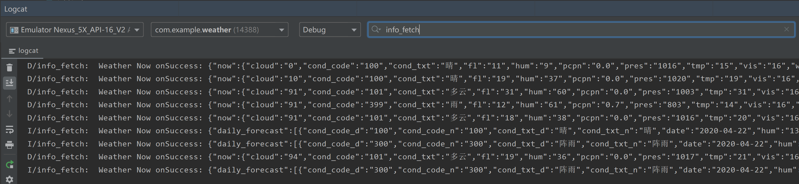

##### 功能2==必做==

> 设计 MainActivity 的 UI，显示城市、温度、天气状况描述和更新时间等信息，要求天气状况使用图标+文字描述，至少一项属性的字体大小和其他属性不同。（3 分，必做）

利用和风天气的Android天气插件实现：

- 将`Heweather_Plugin.jar`导入到工程中，并且引用

  ```java
  implementation 'com.squareup.okhttp3:okhttp:3.9.0'(3.9.0+)
  implementation 'com.google.code.gson:gson:2.6.2'(2.6.2+)
  ```

- 配置Android Manifest权限，在混淆文件中加入如下代码

  ```
  -dontwarn com.squareup.**
  -dontwarn okio.**
  -keep public class org.codehaus.* { *; }
  -keep public class java.nio.* { *; }
  -keep public class com.heweather.plugin.bean.** { *; }
  -keep public class com.heweather.plugin.view.** { *; }
  ```

- 使用`HeWeatherConfig.init("key","location")`初始化Key和Location

- 添加天气插件的右侧大布局左侧横向布局`com.heweather.plugin.view.RightLargeView`

- 给插件布局设置所需要的属性并显示：

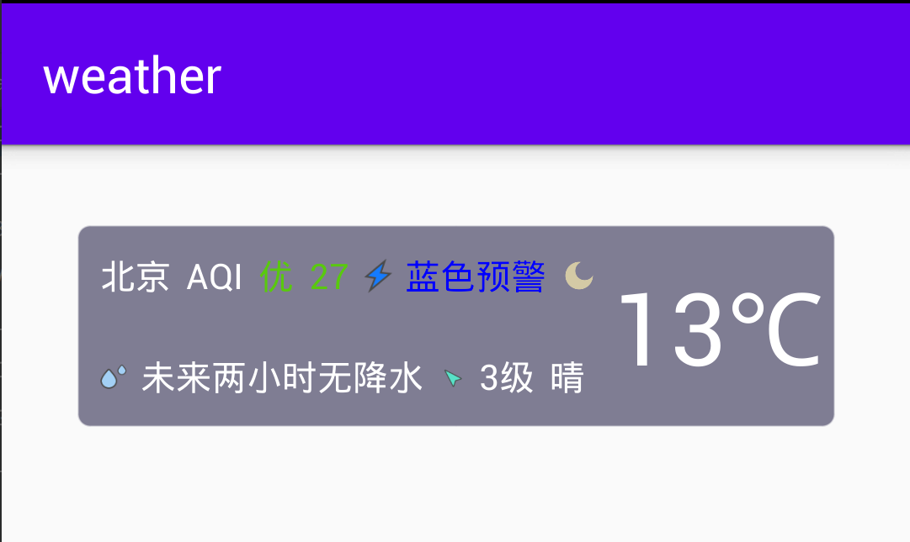

#### 2 Bonus

#### 功能3==选做==

> 查询未来 3 天的天气，通过 ListView 或 RecyclerView 显示未来 3 天的天气，每天至少给出日期、天气和温度信息。（2 分，选做） 

- 使用`HeWeather.getWeatherForecast()`查询城市未来三天的天气，获取`ForecastBase`列表
- 设计`item_forecast`显示每一天的天气，包括日期、天气描述、图标、温度范围、风向，其中图标使用了和风官网的天气图标
- 在`MainActivity`创建`ListView`并关联`Adapter`管理项目的增删和显示：

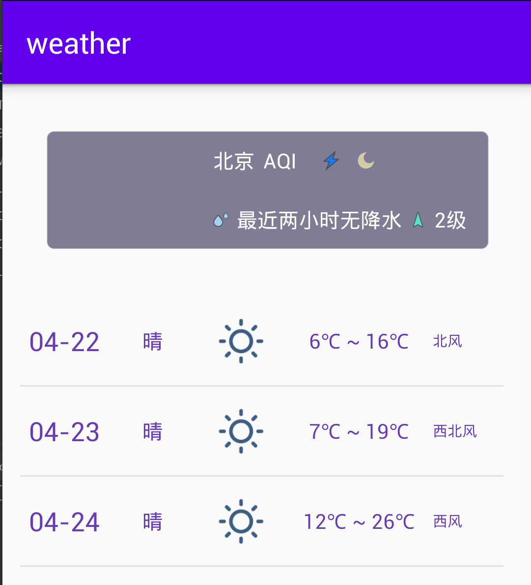

#### 功能4==选做==

> 增加“管理城市”菜单，在 CityActivity 中通过 ListView 或 RecyclerView 显示城市列表，每个城市需要给出城市、当前温度和天气状况描述。（2 分，选做） 

- 设计`item_city`显示每一个城市的信息，包括城市名称、天气描述、图标、当前气温以及一个详情切换按钮
- 在`CityActivity`创建`ListView`并关联`Adapter`管理每一个城市的增删显示

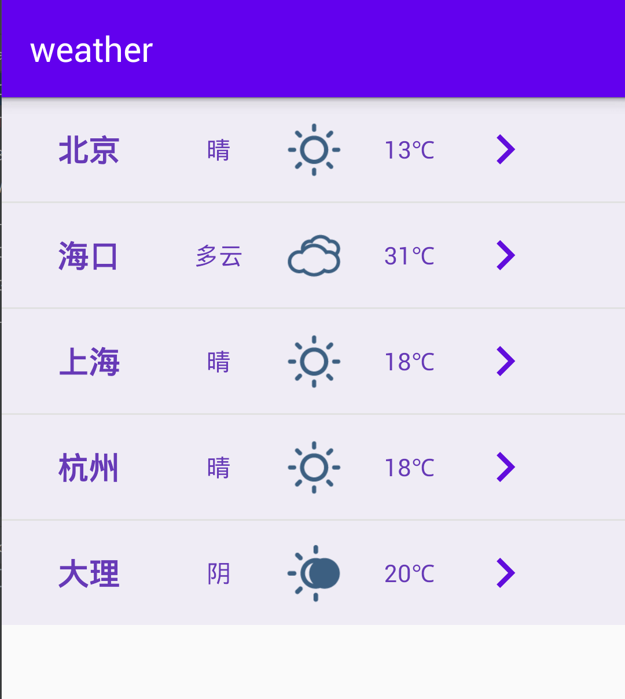

#### 功能5==选做==

> 在 CityActivity 上增加 Floating Action Button，点击后启动 AddCityActivity，增加新的城市，App 再次启动时，也能够看到添加的城市。（2 分，选做）

- 在`CityActivity`添加Floating Action Button，点击监听函数中使用`Intent`切换到`AddCityActivity`
- 设计`AddCityActivity`，添加文本输入框和搜索按钮以及搜索结果的`ListView`
- 点击搜索按钮后调用`HeWeather.getSearch()`函数获取前5个相关城市并在`ListView`中显示
- 点击结果中的城市，通过`Intent`传递城市名称并跳转到`CityActivity`进行添加（图中为昆明）

为了app启动后恢复数据：

- 重写`onCreate`方法，读取内部存储文件`city_list.txt`文件恢复城市列表
- 重写`onStop`方法，当前`ListView`中的城市列表将写入内部存储文件`city_list.txt`

另外，添加了一个加载弹窗，进入app后显示，加载结束后隐藏，可以看到app退出再启动后添加的昆明仍然在列表中：

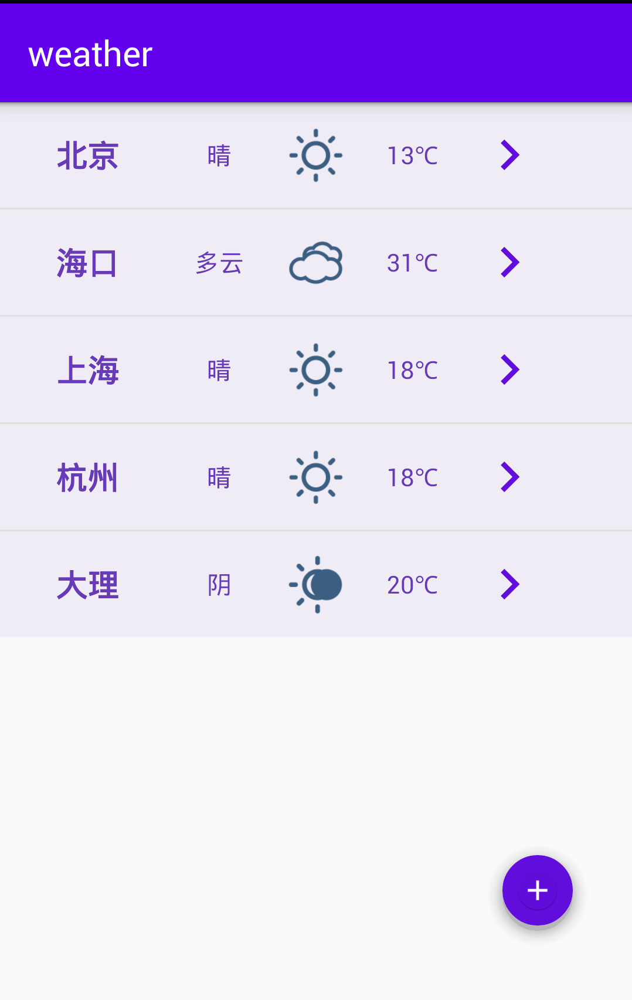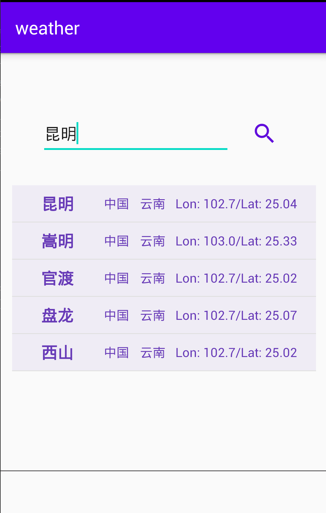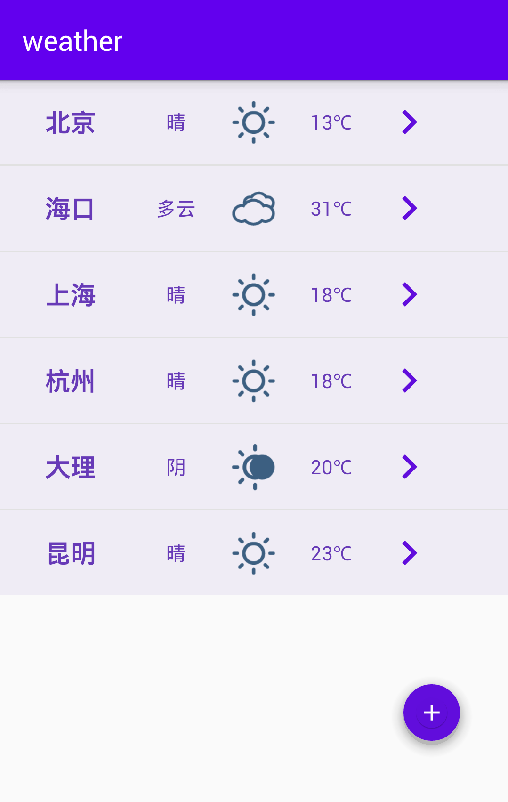

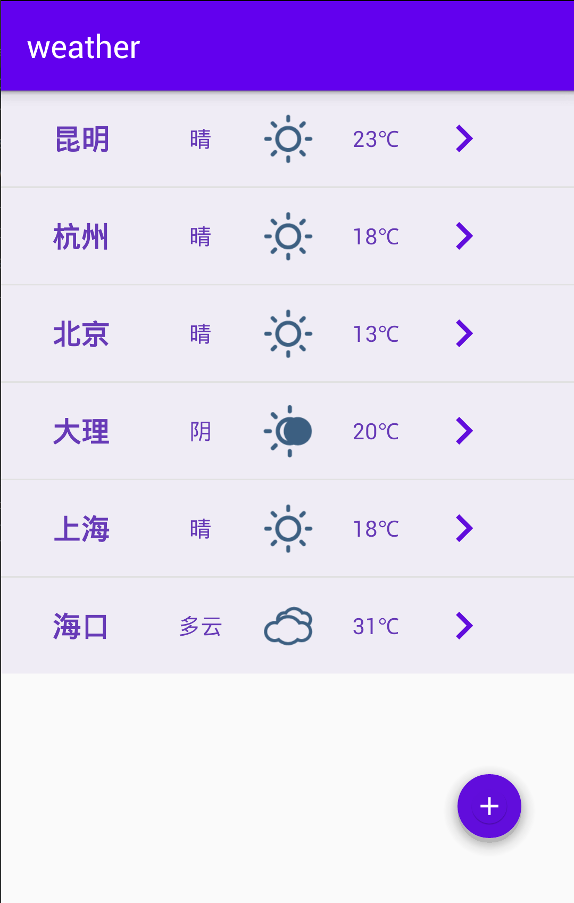

查看data下的`city_list.txt`文件，昆明已经添加：

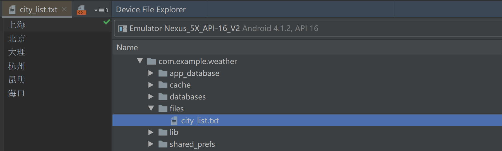

#### 功能6==选做==

> 在 CityActivity 上点击某个城市，返回 MainActivity，显示该城市的天气，通过滑动操作删除城市，App 再次启动时，也未显示该删除的城市。（2 分，选做）

- 为`item_city`视图中的详情按钮添加点击事件，使用`Intent`传递城市名称并跳转到`MainActivity`（图中为杭州）
- 在`CityAdapter`的`getView`中为每个城市视图添加滑动监听事件`setOnTouchListener`并重写`onSwipeLeft()`和`onSwipeLeft()`，事件触发时通过`CityAdapter`删除城市，并弹出提示框提示已经成功删除（图中为杭州）
- 基于之前的数据恢复代码，退出app并再次启动，可以看到杭州已经删除：

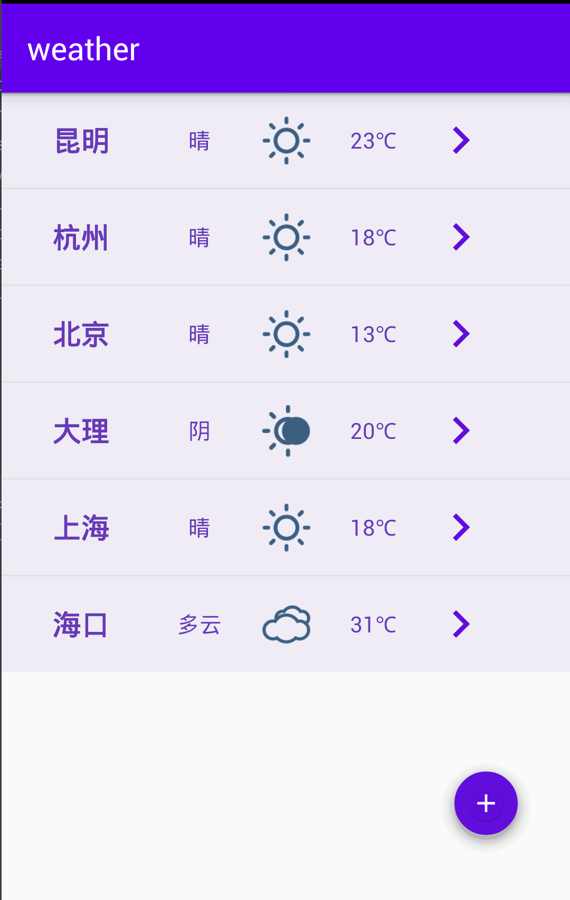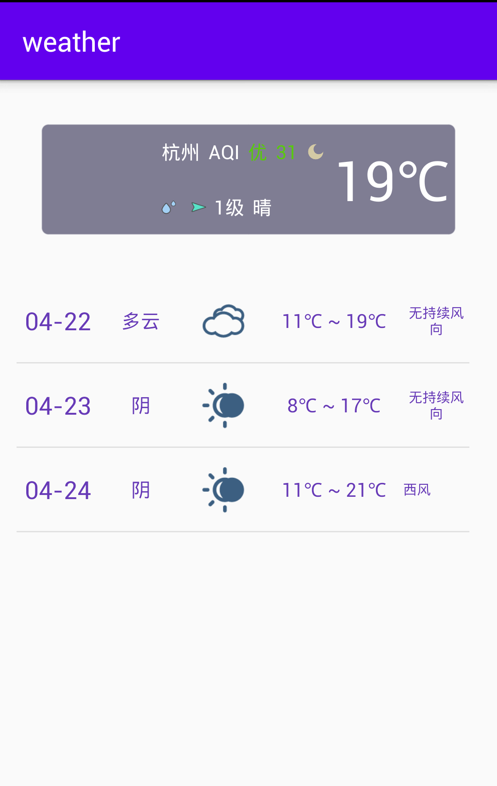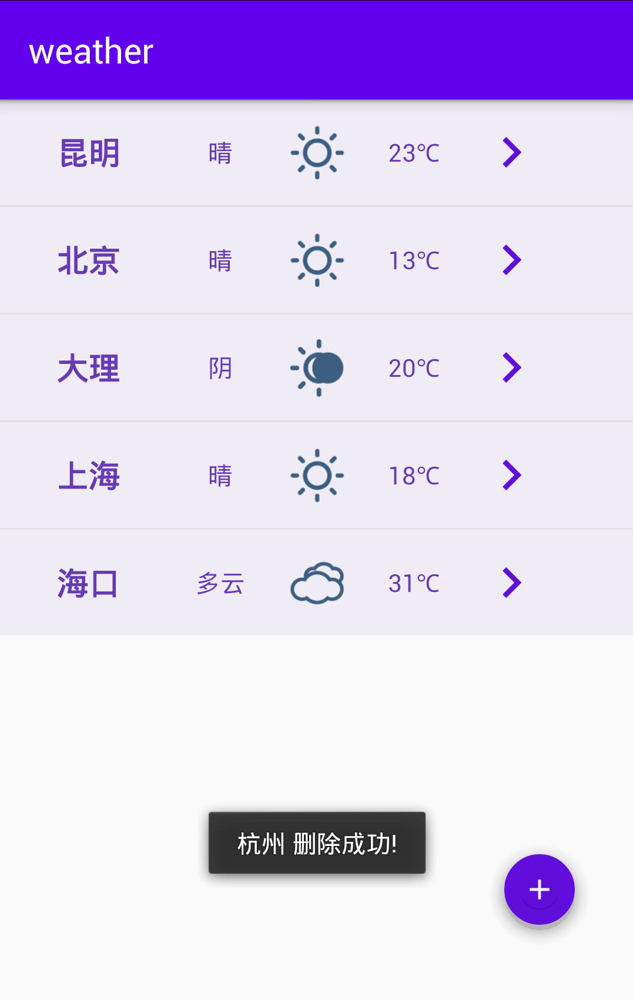

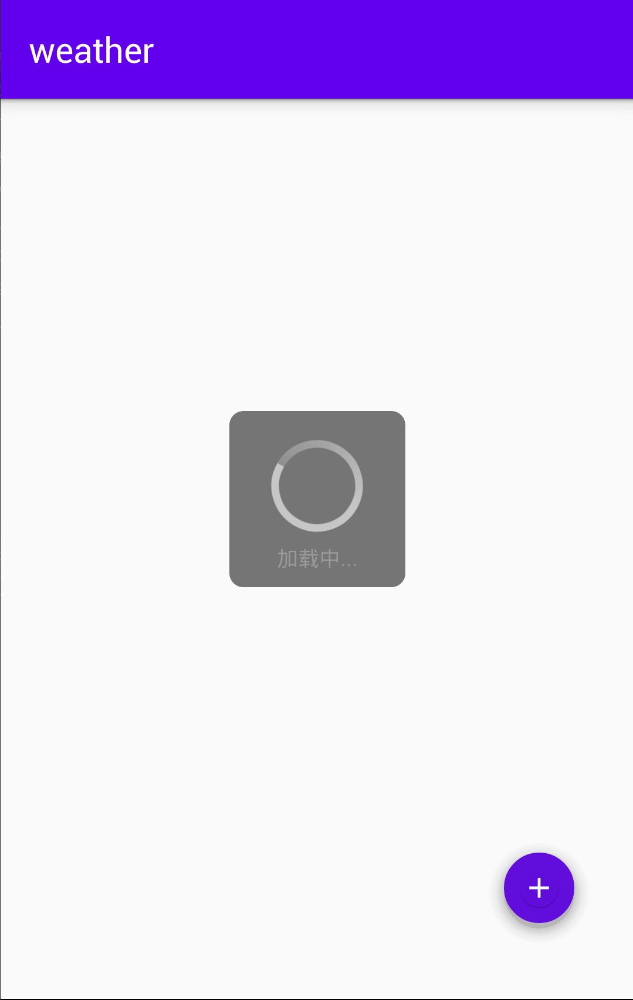

查看data下的`city_list.txt`文件，杭州已经删除：

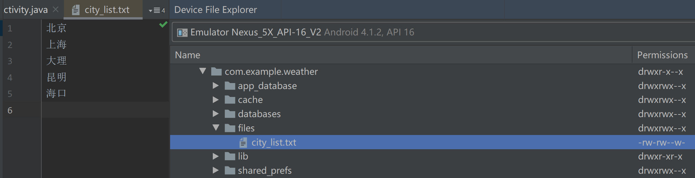

