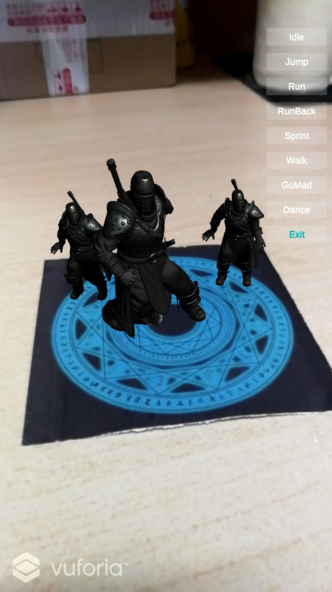

IOS-HW2 Weather App

 
    姓名：陈锰  
    学号：3170105197   
    专业：软件工程

## 1 作业要求

>  利用Unity的AR Foundation完成以一个简单的AR应用

#### 目的：

熟悉AR Foundation的使用

#### 要求:

1. 可以用安卓平台或iOS平台开发
2. 提交实验报告，包括使用到的功能描述和步骤细节
3. 提交代码

#### 注意

arkit支持只ios 11.0 +系统，arcore和sensear支持的设备可见https://openar.sensetime.com/docs和https://developers.google.com/ar/discover/supported-devices?hl=zh-cn，如果没有条件做测试可以使用Vuforia实现简单的功能，详情参考文档https://library.vuforia.com/getting-started/overview.html，Vuforia在Unity中也有集成。

## 2 实现步骤

由于我的手机不支持AR Foundation，并且了解到Vuforia的部分功能在大多数Android手机上是可以支持的，所以本次实验选择了在Unity中使用Vuforia框架完成。

### 主题：基于Vuforia的Image Target实现AR模型的展示和简单交互。

### 2.1 总体框架

### 2.2 Vuforia配置

- 注册开发者账号，获取Lisense
- 上传图片添加Image Target的数据库，要求至少3星才能识别成功
- 新建Unity项目，下载并导入Vuforia包，切换为Android平台并进行项目配置
- 导入Image Target数据库作为Material
- 在场景中新建AR Camera和Image Target，配置之前导入的Material

### 2.3 模型和动画

- 导入Unity Asset Store的Strong Knight模型和Basic 动画
- 调整模型大小和位置，将动画应用到模型之上

### 2.4 UI设计

- logo：使用Wik Logo在线工具自动生成和修改Logo，并将其制作成Material作为项目的icon。

  

- button：通过UnityEngine.UI.Canvas增加多个button用于切换模型动画。

经过以上步骤，可以得到如下结果（游戏场景）：

### 2.5 编写代码

新建MotionController脚本，实现对模型、动画、按钮的控制，具体代码见附件。

## 3 运行结果

Build到真机运行，对各种动画进行测试，由于动画在报告中难以显示，下面展示部分截图：

- Idle

  

- Jump

  

- Run

  

- Run Backwards

  

- Sprint

  

- Walk

  

- Go Mad

  

- Dance

  