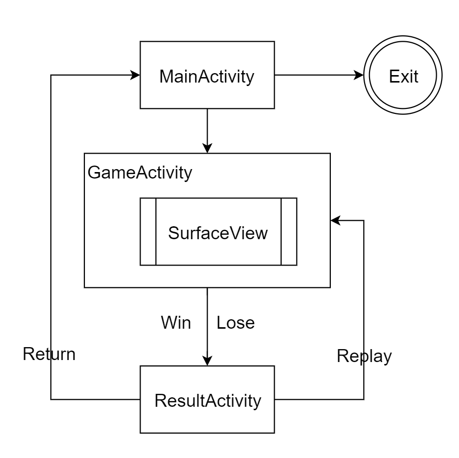
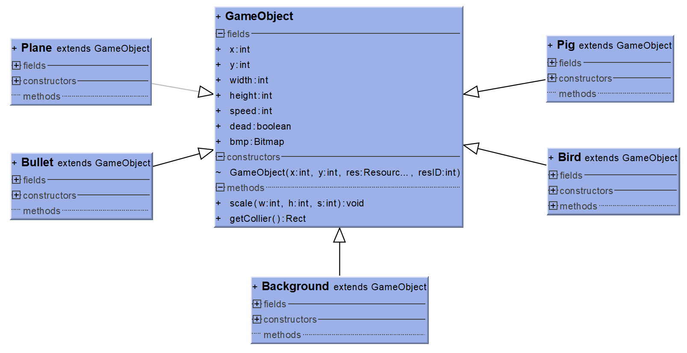
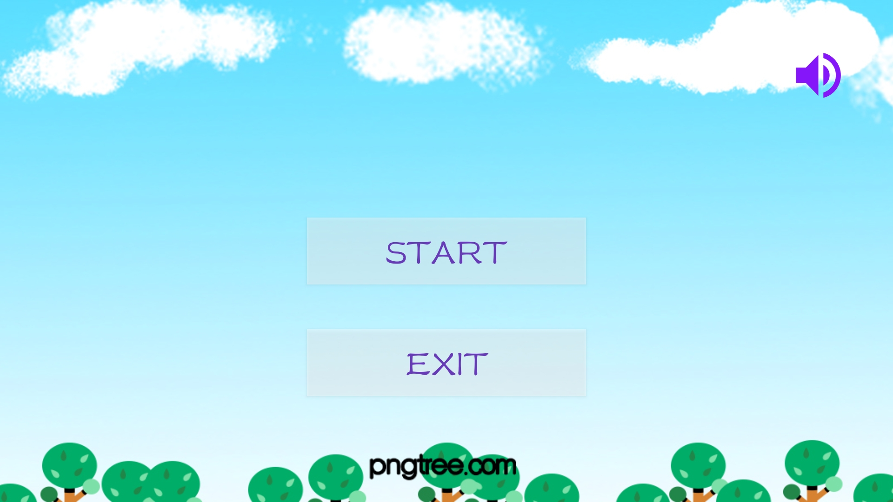
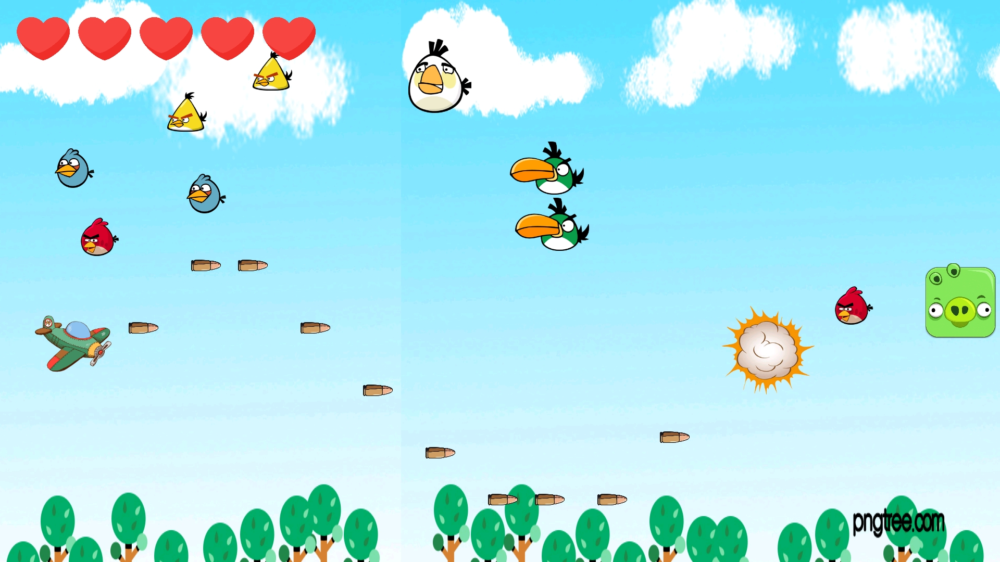
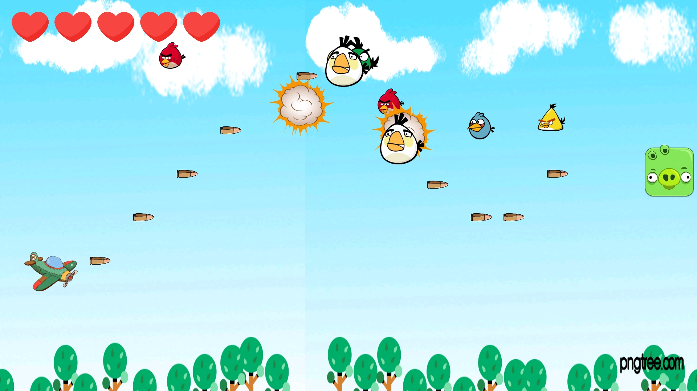
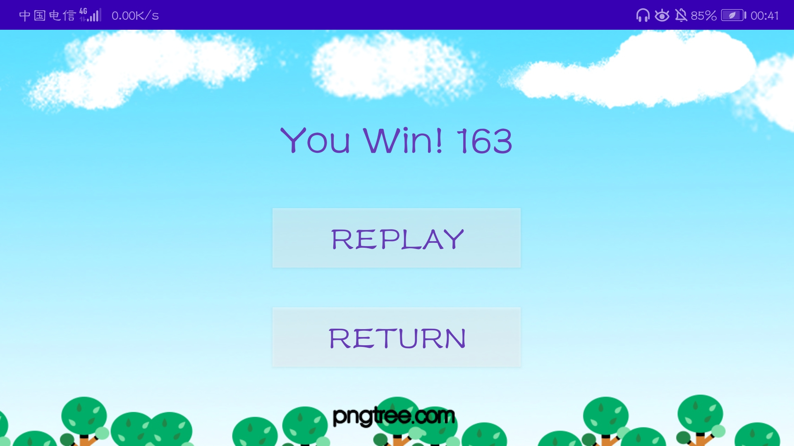
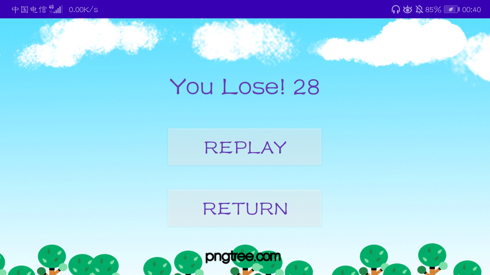

# 
IOS-HW4 飞机大战

 
    姓名：陈锰  
    学号：3170105197   
    专业：软件工程

## 1 作业要求

>  1. 可以使用安卓或者ios完成作业
>
>  2. 使用触屏控制飞机的走向
>
>  3. 我方与对方飞机都可以发射子弹
>
>  4. 子弹与飞机发生碰撞的时候，打开计数器，计数达到某个次数后销毁飞机
>
>  5. 我方飞机销毁时弹出失败提示
>
>  6. 销毁敌方飞机达到一定数量后，弹出成功提示
>
>  7. “飞机”和“子弹”可以不用飞机子弹的图，随意使用。

## 2 设计实现

本项目设计实现了一个类似飞机大战的横屏游戏《Birds Fighting》，以愤怒的小鸟为主题，主要游戏元素有：

- 左侧飞机：代表玩家本身，通过触屏可以控制左侧飞机走向
- 右侧猪头：代表游戏Boss，上下滑动并随机产生愤怒的小鸟
- 小鸟：类似猪头的子弹，触碰到玩家飞机则玩家飞机生命值减一
- 子弹：玩家飞机可以无限发射子弹，触碰到小鸟或者boss消失，敌方生命值减一

### 2.1 总体框架

本项目设计了三个Activity：

- MainActivity：菜单主界面，包括开始、退出按钮控件
- GameActivity：游戏主界面，`GameView`继承一个`SurfaceView`类，用于实现游戏每一帧的循环绘制
- ResultActivity：游戏结果界面，显示胜利或失败以及最后得分，包括重玩、返回按钮控件

### 2.2 类设计

本项目将游戏元素抽象成一个基类：`GameObject`。该类包含所有2D游戏元素的属性和方法：

- X,Y：左上角坐标
- Width, Height：宽高
- Speed：速度，即每一帧的移动距离
- Dead：是否死亡
- Bitmap：元素位图
- scale()：放缩位图
- getCollier()：获取碰撞体矩形

游戏中的`Plane`类、`Bullet`类、`Pig`类、`Bird`类、`Background`类都继承自GameObject类：

这些派生类都实现了各自的构造器，可以加载位图资源并通过`scale()`方法调整缩放比例，用于在canvas上绘制；可以通过`getCollier()`方法获取碰撞体矩形，用于碰撞检测。

### 2.3 游戏循环设计

`GameView`类继承了`Runnable`接口，在重写的`run()`方法中将游戏循环分为三个部分：

- `update`：更新所有`GameObject`的属性
- `draw`：在`canvas`上绘制`GameObject`
- `sleep`：让线程等待一帧的间隔，以60帧/秒的帧率计算，间隔为16.7秒

游戏的主要逻辑在`update`中实现：

- `background`的位置更新：为了实现循环滑动背景效果，将两张背景图串在一起向左移动，移出视口的背景图再次回到初始位置，最终形成循环背景

- `Plane`的位置更新：根据当前状态移动
  - `UP`：玩家按下屏幕上半部分，飞机上移
  - `DOWN`：玩家按下屏幕下半部分，飞机下移
  - `NONE`：玩家不接触屏幕，飞机不动
- `Bullet`的位置更新：根据速度向右移动
- `Pig`的位置更新：以随即速度上下滑动，当飞机与猪头水平猪头则改变滑动方向
- `Bird`的位置更新：从猪头位置出发根据不同速度向左移动

**其他设计**

- 爆炸显示：小鸟、猪头、玩家死亡后用一帧显示爆炸位图

- 分数计算：玩家射中一只小鸟加1分，射死猪头加20分
- 生命值显示：玩家有5个生命值，左上角用5个心形显示，每次被小鸟击中减一
- 胜利/失败：玩家生命值为零失败，射死猪头胜利，通过`Intent`传递分数和结果至`ResultActivity`显示

## 3 运行结果

- MainActivity

  

- GameActivity/SurfaceView

  

  

- ResultActivity

  

  